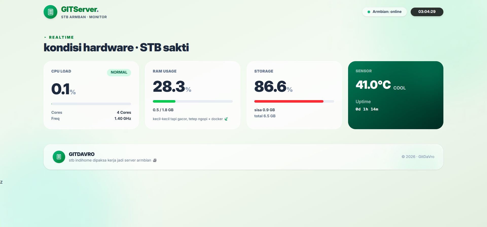

<div align="center">

# STB Server Dashboard

### Monitoring realtime untuk STB Armbian yang menolak pensiun.



<br>

Built with HTML, Vanilla JavaScript, Python, and a healthy amount of curiosity.

</div>

---

## Sekilas

STB Server Dashboard adalah dashboard monitoring ringan yang dibuat untuk perangkat STB berbasis Armbian Linux.

Project ini berawal dari kebutuhan sederhana: melihat kondisi server dari browser tanpa harus bolak-balik masuk SSH hanya untuk mengecek CPU, RAM, suhu, atau uptime.

Karena ternyata cukup berguna, akhirnya berkembang menjadi dashboard kecil dengan tampilan yang modern, responsif, dan tetap ringan dijalankan pada perangkat dengan spesifikasi terbatas.

---

## Yang Dipantau

```text
CPU Usage
CPU Frequency
CPU Cores
RAM Usage
Storage Usage
Available Storage
Temperature
System Uptime
Node Status
```

---

## Fitur

* Monitoring realtime
* Material You inspired interface
* Ripple effect ala Android
* Responsive layout
* Dynamic thermal indicator
* Auto refresh data
* Visibility-aware polling
* Automatic fallback mode
* Tanpa database
* Tanpa framework frontend

---

## Cara Kerja

```text
┌───────────────┐
│   Browser     │
└───────┬───────┘
        │
        │ GET /api/status
        │
┌───────▼───────┐
│    app.py     │
│ HTTP Server   │
└───────┬───────┘
        │
        ├─ /proc/meminfo
        ├─ /proc/cpuinfo
        ├─ /proc/uptime
        └─ thermal_zone0
```

---

## Struktur Project

```text
.
├── app.py
├── index.html
└── README.md
```

---

## Menjalankan

```bash
python3 app.py
```

Lalu buka:

```text
http://IP_SERVER:5000
```

---

## Filosofi Project

Banyak tool monitoring yang luar biasa canggih.

Tapi kadang yang dibutuhkan cuma halaman sederhana yang bisa menjawab pertanyaan:

> "Server masih hidup kan?"

Dan itu sudah cukup.

---

## Catatan

Project ini dibuat dan diuji pada perangkat STB yang menjalankan Armbian Linux dengan sumber daya yang terbatas.

Tidak ada database.

Tidak ada framework frontend.

Tidak ada dependency yang aneh-aneh.

Hanya Python, HTML, JavaScript, dan sebuah STB yang dipaksa bekerja lebih keras dari takdir awalnya.

---

<div align="center">

**Made for Armbian. Tested on STB. Powered by curiosity.**

</div>
